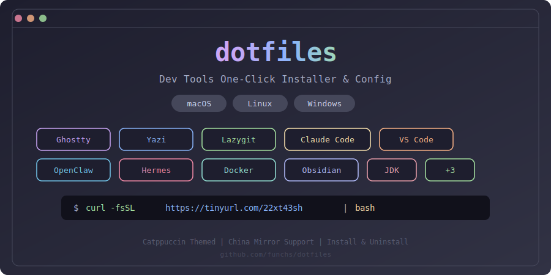

<p align="center">
  
</p>

<p align="center">
  <strong>macOS / Linux / Windows 开发工具一键安装与配置脚本</strong>
</p>

> **[使用手册 (User Guide)](docs/USER_GUIDE.md)** — 完整的本地使用示例、配置详解、常见问题解答

## 支持的工具

| 工具 | 说明 | macOS | Linux | Windows |
|------|------|:-----:|:-----:|:-------:|
| [Ghostty](https://ghostty.org) | GPU 加速终端模拟器（毛玻璃 / 分屏 / Quake 下拉） | brew cask | 包管理器/snap | - (*) |
| [Yazi](https://yazi-rs.github.io) | 终端文件管理器（快速预览 / Vim 风格导航） | brew | brew | scoop |
| [Lazygit](https://github.com/jesseduffield/lazygit) | 终端 Git UI（可视化提交 / 分支 / 合并） | brew | brew | scoop |
| [Claude Code](https://docs.anthropic.com/en/docs/claude-code) | Anthropic AI 编程助手（终端内 AI 编程） | 官方脚本 | 官方脚本 | 官方脚本/npm |
| [OpenClaw](https://openclaw.com) | 本地 AI 助手（自托管 / 任务自动化） | brew | brew | winget |
| [Hermes Agent](https://github.com/nousresearch/hermes-agent) | Nous Research 自学习 AI Agent（技能/记忆/多平台） | 官方脚本 | 官方脚本 | 官方脚本 |
| [Antigravity](https://developers.google.com) | Google AI 开发平台（智能编码 / Agent 工作流） | brew cask | - | winget |
| OrbStack / Docker | 容器 & Kubernetes | OrbStack | Docker Engine | Docker Desktop |
| [Obsidian](https://obsidian.md) | 知识管理 & 笔记工具（Markdown / 双链 / Excalidraw） | brew cask | flatpak/snap | winget |
| Maccy / Ditto | 剪贴板管理工具 | Maccy | CopyQ | Ditto |
| JDK | Java 开发工具包（SDKMAN / 多版本切换） | SDKMAN | SDKMAN | winget/scoop |
| [VS Code](https://code.visualstudio.com) | 代码编辑器 + Catppuccin 主题 + 中文 + Claude Code 插件 | brew cask | APT/DNF/snap | 直接下载/scoop |

> (*) Ghostty 目前仅支持 macOS 和 Linux，Windows 上选择后会自动跳过。

## 一键安装

### macOS / Linux

```bash
curl -fsSL https://tinyurl.com/25n5uezk | bash
```

国内加速：

```bash
curl -fsSL https://tinyurl.com/2xrksrcy | bash
```

### Windows

```powershell
irm https://tinyurl.com/225zvy2o | iex
```

国内加速：

```powershell
irm https://tinyurl.com/25pho3w9 | iex
```

## 一键卸载

### macOS / Linux

```bash
curl -fsSL https://tinyurl.com/25n5uezk | bash -s -- --uninstall
```

国内加速：

```bash
curl -fsSL https://tinyurl.com/2xrksrcy | bash -s -- --uninstall
```

### Windows

```powershell
irm https://tinyurl.com/25pho3w9 -OutFile $env:TEMP\i.ps1; & $env:TEMP\i.ps1 --uninstall
```

## 用法

### macOS / Linux (`install.sh`)

```bash
# 交互式选择（方向键导航 + 空格选择 + u 卸载）
./install.sh

# 安装全部工具
./install.sh --all

# 只安装指定工具
./install.sh ghostty yazi lazygit
./install.sh claude vscode

# 卸载已安装的工具
./install.sh --uninstall

# 跳过工具安装，仅修改配置
./install.sh --skip

# 仅切换 Claude API 提供商
./install.sh claude-provider

# 强制使用国内镜像加速
./install.sh --mirror
```

### Windows (`install.ps1`)

```powershell
# 交互式选择（数字编号 + 逗号分隔多选）
.\install.ps1

# 安装全部工具
.\install.ps1 --all

# 只安装指定工具
.\install.ps1 ghostty yazi lazygit
.\install.ps1 claude vscode

# 卸载已安装的工具
.\install.ps1 --uninstall

# 跳过工具安装，仅修改配置
.\install.ps1 --skip

# 仅切换 Claude API 提供商
.\install.ps1 claude-provider

# 强制使用国内镜像加速
.\install.ps1 --mirror
```

## 交互式菜单

### macOS / Linux

```
╔══════════════════════════════════════════════╗
║     macOS 开发工具一键安装与配置             ║
╚══════════════════════════════════════════════╝

操作: ↑↓ 移动  空格 选择/取消  a 全选  u 卸载  回车 确认  q 退出

  > [*] Ghostty      GPU 加速终端模拟器
    [*] Yazi         终端文件管理器
    [ ] Lazygit      终端 Git UI
    [ ] Claude Code  Anthropic AI 编程助手
    ...
```

### Windows

```
================================================
   Windows Dev Tools One-Click Installer
================================================

 1) Ghostty      GPU 加速终端模拟器
 2) Yazi         终端文件管理器
 3) Lazygit      终端 Git UI
 4) Claude Code  Anthropic AI 编程助手
 ...
12) VS Code      代码编辑器

  A) 全部安装
  U) 卸载已安装的工具
  S) 跳过安装，仅修改配置
  Q) 退出

请输入编号 (多选用逗号分隔, 例: 1,3,4):
```

## 环境基础检查

脚本会自动检测并安装以下基础依赖（无需手动选择）：

| 依赖 | macOS / Linux | Windows |
|------|--------------|---------|
| 编译工具链 | Xcode CLT / build-essential | - |
| Zsh | 安装 + 设为默认 Shell | - |
| 包管理器 | Homebrew | Scoop + winget |
| Git | brew | scoop |
| NVM + Node.js LTS | nvm-sh | scoop nvm |
| Bun | brew | scoop |

Shell 提示符（Starship / Oh My Posh / Oh My Zsh）在安装 Ghostty 时询问配置。

> 使用 `--skip` 可跳过基础检查，直接进入配置菜单。

## 平台差异

| 功能 | macOS | Linux | Windows |
|------|-------|-------|---------|
| 包管理器 | Homebrew | Homebrew + 原生 (apt/dnf/pacman) | Scoop + winget |
| Shell 提示符 | Oh My Zsh / Starship | Oh My Zsh / Starship | Starship / Oh My Posh |
| 容器工具 | OrbStack | Docker Engine | Docker Desktop |
| 剪贴板管理 | Maccy | CopyQ | Ditto (+ Win+V) |
| Nerd Font 安装 | brew cask | GitHub 下载到 ~/.local/share/fonts | scoop nerd-fonts bucket |
| Ghostty 快捷键 | Cmd 系列 | Ctrl 系列 | - (不支持) |
| VS Code 配置路径 | ~/Library/Application Support/Code/ | ~/.config/Code/ | %APPDATA%\Code\ |
| Claude 提供商配置 | ~/.zshrc 标记块 | ~/.zshrc 标记块 | 用户环境变量 + ~/.claude/settings.json |

## Claude 提供商配置

安装 Claude Code 时或使用 `claude-provider` 参数可配置 API 提供商：

| 选项 | 提供商 | 所需配置 |
|------|--------|----------|
| 1 | Anthropic 直连 | `ANTHROPIC_API_KEY` |
| 2 | Amazon Bedrock | AWS 凭证 (AK/SK) 或 AWS Profile |
| 3 | Google Vertex AI | GCP 项目 ID + Region |
| 4 | 自定义 API 代理 | Base URL + API Key |
| 5 | 清除配置 | 移除已有提供商设置 |

macOS/Linux 配置写入 `~/.zshrc` 的标记块中，Windows 写入用户环境变量 + `~/.claude/settings.json`。

## VS Code 自动配置

安装 VS Code 时自动完成：

- Catppuccin Latte 主题 + Icons 图标主题
- 中文语言包 (`MS-CEINTL.vscode-language-pack-zh-hans`)
- 界面语言切换为中文 (`~/.vscode/argv.json`)
- Claude Code 插件 (`anthropic.claude-code`)

## 配置文件位置

### macOS / Linux

```
~/.config/ghostty/config       # Ghostty 终端配置
~/.config/yazi/                # Yazi 文件管理器配置
  ├── yazi.toml                #   主配置
  ├── keymap.toml              #   快捷键
  ├── theme.toml               #   主题
  └── init.lua                 #   插件初始化
~/.config/lazygit/config.yml   # Lazygit 配置
~/.config/starship.toml        # Starship 提示符配置
~/.zshrc                       # Shell 集成 + Claude 提供商
~/.vscode/argv.json            # VS Code 语言设置
```

### Windows

```
%APPDATA%\ghostty\config       # Ghostty 终端配置
%APPDATA%\yazi\config\         # Yazi 文件管理器配置
%APPDATA%\lazygit\config.yml   # Lazygit 配置
%APPDATA%\Code\User\settings.json  # VS Code 设置
%USERPROFILE%\.config\starship.toml  # Starship 提示符配置
%USERPROFILE%\.vscode\argv.json     # VS Code 语言设置
%USERPROFILE%\.claude\settings.json  # Claude 提供商配置
```

## 常用快捷键

### Ghostty

| 快捷键 | macOS | Linux / Windows | 功能 |
|--------|-------|-----------------|------|
| 全局唤出 | `Ctrl+`` ` | `Ctrl+`` ` | 快捷终端 |
| 新标签页 | `Cmd+T` | `Ctrl+Shift+T` | 新建标签页 |
| 右侧分屏 | `Cmd+D` | `Ctrl+Shift+D` | 垂直分屏 |
| 下方分屏 | `Cmd+Shift+D` | `Ctrl+Shift+E` | 水平分屏 |
| 重载配置 | `Cmd+Shift+,` | - | 重载配置文件 |

### Yazi

| 快捷键 | 功能 |
|--------|------|
| `y` | 启动 Yazi（退出后 cd 到浏览目录） |
| `.` | 显示/隐藏隐藏文件 |
| `gd` / `gD` / `gh` | 跳转到 Downloads / Desktop / Home |
| `T` | 在 Ghostty 中打开当前目录 |
| `C` | 在 VS Code 中打开当前目录 |
| `S` | 在当前目录打开 Shell |

### Lazygit

| 快捷键 | 功能 |
|--------|------|
| `O` | 在浏览器中打开仓库 |
| `F` | 创建 fixup commit |
| `Y` | 复制分支名到剪贴板 |

## 国内镜像加速

脚本启动时自动检测 GitHub 连通性，不可达时提示启用国内镜像：

- GitHub 下载加速：`ghfast.top` URL 前缀代理
- Homebrew 镜像：USTC (仅 macOS/Linux)
- Node.js 镜像：npmmirror (仅 macOS/Linux)

也可通过 `--mirror` 参数强制启用镜像模式。

## License

MIT
